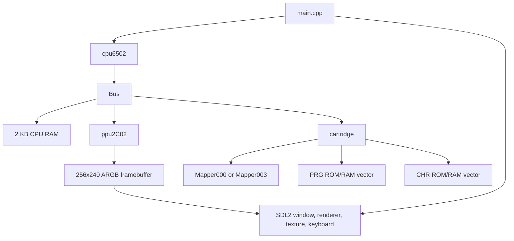

# NES Emulator Implementation Guide

This document explains how this emulator is put together, how execution flows through
the codebase, and where each major NES subsystem is represented. It is intended for
future development, debugging, and onboarding.

The best format for this material is a version-controlled Markdown guide. The emulator
is small enough that one document can cover the full architecture, but the subject is
detailed enough to benefit from headings, tables, and diagrams. Markdown also keeps the
documentation readable in the repository, on GitHub, and in local editors without adding
another documentation toolchain.

## Project Layout

The implementation is a compact C++20 codebase. SDL2 is used for the desktop frontend,
while the emulator core is implemented in plain C++ classes.

| Path | Purpose |
| --- | --- |
| `src/main.cpp` | Program entry point, SDL2 setup, main emulation loop, input sampling, video presentation, frame pacing |
| `src/cpu6502.h` | CPU register state, status flags, opcode table, instruction declarations |
| `src/cpu6502.cpp` | CPU execution loop, addressing modes, official opcode implementations, reset/IRQ/NMI logic, CPU logging helpers |
| `src/Bus.h` | Bus interface, CPU RAM, PPU ownership, cartridge pointer, controller state |
| `src/Bus.cpp` | CPU memory map, PPU register forwarding, controller reads/writes, OAM DMA, PPU clock forwarding |
| `src/ppu2C02.h` | PPU state, CPU/PPU bus interfaces, framebuffer, OAM, rendering helpers |
| `src/ppu2C02.cpp` | PPU register behavior, PPU memory map, scroll state, sprite evaluation, pixel rendering, scanline timing |
| `src/cartridge.h` | Cartridge state, PRG/CHR storage, mapper and mirroring metadata |
| `src/cartridge.cpp` | iNES loading, mapper construction, cartridge CPU/PPU read/write forwarding |
| `src/Mapper.h` | Base mapper interface for CPU and PPU address translation |
| `src/Mapper.cpp` | Default mapper methods, all returning unmapped |
| `src/Mapper000.h`, `src/Mapper000.cpp` | Mapper 0 / NROM implementation |
| `src/Mapper003.h`, `src/Mapper003.cpp` | Mapper 3 / CNROM implementation with CHR bank switching |
| `Makefile` | Build rules for the emulator, profiling builds, and assembly output |
| `nestest_diff.py` | Helper script intended for comparing CPU logs against `nestest` output |
| `README.md` | Short usage notes and high-level task list |

At runtime, ownership looks like this:



The CPU owns a `Bus` pointer. The bus owns the PPU object and a cartridge pointer. The
cartridge owns PRG and CHR data and delegates address translation to a mapper.

## Runtime Flow

The emulator starts in `main()`:

1. Validate that a ROM path argument was provided.
2. Construct `cpu6502` with the ROM path.
3. The CPU constructor allocates a `Bus`.
4. The bus constructs and initializes a `cartridge`.
5. The cartridge parses the iNES header, reads PRG/CHR data, and creates the mapper.
6. The bus connects the cartridge to the PPU.
7. `main()` calls `cpu.reset()`.
8. SDL2 is initialized for video output.
9. The main loop repeatedly advances the CPU once and the PPU three times.
10. When the PPU finishes a frame, SDL input is sampled and the framebuffer is presented.

The core emulation ratio is explicit in `src/main.cpp`:

```cpp
cpu.clock();
cpu.bus->clock();
cpu.bus->clock();
cpu.bus->clock();
```

`Bus::clock()` calls `ppu.clock()`, so this produces the NES 3:1 PPU-to-CPU clock ratio.

## CPU Design

The CPU is implemented by `cpu6502`. It models the Ricoh 2A03's 6502-like CPU core,
minus decimal-mode arithmetic because the NES CPU does not support decimal mode.

### CPU State

The public CPU state in `src/cpu6502.h` includes:

| Field | Meaning |
| --- | --- |
| `accum` | Accumulator register `A` |
| `x` | Index register `X` |
| `y` | Index register `Y` |
| `stackp` | 8-bit stack pointer, targeting CPU page `$0100` |
| `progc` | 16-bit program counter |
| `status` | Processor status register |
| `fetched` | Temporary fetched operand byte |
| `addr_absolute` | Effective absolute address for the current instruction |
| `addr_relatvie` | Relative branch offset. The name is misspelled in code but used consistently |
| `opcode` | Current opcode byte |
| `cycles` | Remaining cycles for the current instruction |
| `bus` | Pointer to the system bus |

The status flags are represented by `FLAGS6502`:

| Flag | Bit | Meaning |
| --- | --- | --- |
| `C` | 0 | Carry |
| `Z` | 1 | Zero |
| `I` | 2 | Interrupt disable |
| `D` | 3 | Decimal mode flag. Present for status compatibility, but decimal arithmetic is not implemented |
| `B` | 4 | Break |
| `U` | 5 | Unused/status constant bit |
| `V` | 6 | Overflow |
| `N` | 7 | Negative |

`getFlag()` and `setFlag()` centralize status-register access.

### Opcode Table

Instruction dispatch is table-driven. `cpu6502::lookup` is a 256-entry static vector of
`INSTRUCTION` records:

```cpp
struct INSTRUCTION {
    std::string name;
    uint8_t(cpu6502::*operate)() = nullptr;
    uint8_t(cpu6502::*addrmode)() = nullptr;
    uint8_t cycles = 0;
};
```

Each opcode maps to:

- A mnemonic string.
- An operation member function such as `LDA`, `ADC`, `JSR`, or `BEQ`.
- An addressing-mode member function such as `IMM`, `ABS`, `INDX`, or `REL`.
- A base cycle count.

Official instructions are implemented as member functions in `src/cpu6502.cpp`.
Undefined opcodes are mostly mapped to `DUM()` or `NOP()`. `DUM()` currently returns an
extra-cycle signal but does not emulate unofficial opcode behavior.

### CPU Clocking

`cpu6502::clock()` advances the CPU by one CPU cycle. It does not execute a whole
instruction on every call. Instead, it starts a new instruction only when `cycles == 0`,
then counts down one cycle per call.

The instruction start sequence is:

1. Check whether the PPU has asserted `nmi`; if so, clear it and call `nonMskInter()`.
2. Read an opcode from the current `progc`, then increment `progc`.
3. Load the opcode's base cycle count from `lookup`.
4. Run the addressing mode, which prepares `addr_absolute`, `addr_relatvie`, or
   `fetched`.
5. Run the operation.
6. Add a page-cross or operation-dependent penalty when both the addressing mode and
   operation request it.
7. Decrement `cycles`.

The key extra-cycle rule is:

```cpp
cycles += (addCycleAddr & addCycleOp);
```

This matches the common 6502 emulator pattern where some addressing modes return `1`
for page crossing, and only certain read instructions consume that extra cycle.

### Addressing Modes

The CPU implements the standard addressing modes:

| Method | Addressing mode | Behavior |
| --- | --- | --- |
| `IMP()` | Implied/accumulator | Uses `accum` as the fetched value |
| `IMM()` | Immediate | Uses the next byte at `progc` as the operand address |
| `ZP0()` | Zero page | Reads a one-byte address and masks it to `$00FF` |
| `ZPX()` | Zero page,X | Adds `x` and wraps inside zero page |
| `ZPY()` | Zero page,Y | Adds `y` and wraps inside zero page |
| `REL()` | Relative | Reads a signed branch displacement and sign-extends it |
| `ABS()` | Absolute | Reads low and high bytes and forms a 16-bit address |
| `ABX()` | Absolute,X | Adds `x`; returns an extra-cycle signal on page crossing |
| `ABY()` | Absolute,Y | Adds `y`; returns an extra-cycle signal on page crossing |
| `IND()` | Indirect | Reads a pointer for `JMP (addr)` and emulates the 6502 `$xxFF` wrap bug |
| `INDX()` | Indexed indirect | Adds `x` to a zero-page pointer, then reads the 16-bit target |
| `INDY()` | Indirect indexed | Reads a zero-page pointer, adds `y`, and signals page crossing |

`fetch()` reads `addr_absolute` through the bus for all non-implied modes. Implied
instructions already placed the accumulator value in `fetched`.

### Instruction Families

The operation implementations are grouped naturally by behavior:

| Family | Implemented operations |
| --- | --- |
| Loads and stores | `LDA`, `LDX`, `LDY`, `STA`, `STX`, `STY` |
| Register transfers | `TAX`, `TAY`, `TSX`, `TXA`, `TXS`, `TYA` |
| Stack | `PHA`, `PHP`, `PLA`, `PLP` |
| Arithmetic and logic | `ADC`, `SBC`, `AND`, `EOR`, `ORA`, `BIT` |
| Compare | `CMP`, `CPX`, `CPY` |
| Increment/decrement | `INC`, `INX`, `INY`, `DEC`, `DEX`, `DEY` |
| Shifts and rotates | `ASL`, `LSR`, `ROL`, `ROR` |
| Branches | `BCC`, `BCS`, `BEQ`, `BMI`, `BNE`, `BPL`, `BVC`, `BVS` |
| Jumps/subroutines | `JMP`, `JSR`, `RTS` |
| Interrupt-related | `BRK`, `RTI`, `interruptReq`, `nonMskInter` |
| Flag operations | `CLC`, `CLD`, `CLI`, `CLV`, `SEC`, `SED`, `SEI` |
| Miscellaneous | `NOP`, `DUM` |

Most operations update `Z` and `N` after writing a register or result. Arithmetic
operations update `C`, `Z`, `N`, and `V`. Branches add one cycle when taken and a second
cycle when the branch crosses a page.

### Reset, IRQ, and NMI

`reset()` reads the reset vector from `$FFFC/$FFFD`, initializes registers, and assigns
8 cycles. Because reads go through the bus, the vector is supplied by cartridge PRG ROM
through the mapper.

`interruptReq()` implements maskable IRQ behavior:

- It exits immediately if `I` is set.
- It pushes the program counter high byte, program counter low byte, and status.
- It clears `B`, sets `U` and `I`, reads the IRQ vector at `$FFFE/$FFFF`, and assigns
  7 cycles.

No current component calls `interruptReq()`, because the emulator does not yet include
APU frame IRQs, DMC IRQs, or mapper IRQs.

`nonMskInter()` implements NMI behavior similarly, but it always runs and reads the
vector at `$FFFA/$FFFB`. The PPU sets `nmi = true` when vblank starts and bit 7 of
`PPUCTRL` is enabled. `cpu6502::clock()` consumes that signal.

`BRK()` is currently simplified: it advances `progc`, sets the interrupt-disable flag,
and returns. It does not currently push PC/status or jump through the IRQ/BRK vector.

### CPU Logging

The CPU constructor opens `/tmp/cpu_log.txt`, truncates it, and writes one
`cpuLog_clean()` line. There are helper methods for formatted CPU status, but the active
execution loop does not currently emit one line per instruction. The `nestest_diff.py`
script appears intended for this, but it is not wired into the runtime yet.

## Bus Design

`Bus` is the CPU-visible address decoder and subsystem connector. The CPU never talks
directly to the cartridge, PPU registers, RAM, or controllers; it uses `cpuRead()` and
`cpuWrite()`.

### Bus-Owned Devices

`Bus` owns or references:

- `cpuMem`: 2 KB internal CPU RAM.
- `ppu`: the `ppu2C02` instance.
- `cart`: cartridge pointer allocated during bus construction.
- `controller`: current controller button state for two ports.
- `controllerState`: shift-register snapshots used by serial controller reads.
- `controllerStrobe`: tracks `$4016` strobe behavior.
- `clockCntr`: incremented on each bus clock but not otherwise used.

### CPU Memory Map

`Bus::cpuRead()` and `Bus::cpuWrite()` implement this map:

| CPU address range | Implementation |
| --- | --- |
| `$0000-$1FFF` | 2 KB internal RAM mirrored every `$0800` bytes with `addr & 0x07FF` |
| `$2000-$3FFF` | PPU registers mirrored every 8 bytes with `addr & 0x0007` |
| `$4014` | OAM DMA write; copies 256 bytes from CPU page `data << 8` into PPU OAM |
| `$4016` write | Controller strobe and controller-state reload |
| `$4016-$4017` read | Serial controller reads for ports 0 and 1 |
| `$4020-$FFFF` | Cartridge space where supported by the active mapper |

The cartridge is queried first. If the mapper handles the address, the bus returns
without checking internal RAM or I/O. For normal NES cartridges this is how `$8000` and
above resolve to PRG ROM, while lower memory remains on the bus.

### OAM DMA

Writing to `$4014` triggers a 256-byte transfer into `ppu.oam`, starting from CPU
address `data << 8`. The implementation performs the copy immediately:

```cpp
uint16_t dmaSrc = static_cast<uint16_t>(data) << 8;
for (int i = 0; i < 256; i++) {
    ppu.oam[ppu.oamAddr] = cpuRead(dmaSrc + i);
    ppu.oamAddr++;
}
```

This captures the data movement but not the CPU stall timing that real OAM DMA causes.

### Controller I/O

The controller enum stores bits in NES serial output order:

| Bit | Button |
| --- | --- |
| 7 | A |
| 6 | B |
| 5 | Select |
| 4 | Start |
| 3 | Up |
| 2 | Down |
| 1 | Left |
| 0 | Right |

When `$4016` is written, the bus updates `controllerStrobe` and reloads the shift
states from the current controller bytes. When `$4016` or `$4017` is read, the bus
returns the high bit as `0` or `1`. If strobe is low, it shifts the snapshot left after
each read.

`main.cpp` only populates controller port 0, so player 2 reads are structurally present
but not connected to SDL input.

## Cartridge and Mapper Design

The cartridge layer handles ROM loading and delegates all address translation to mapper
objects. This keeps cartridge storage separate from mapper-specific banking rules.

### iNES Loading

`cartridge::initCart()` performs these steps:

1. Open the ROM path in binary mode.
2. Read the 16-byte iNES header.
3. Validate the magic bytes `N`, `E`, `S`, `0x1A`.
4. Compute `mapperID` from header flags 6 and 7.
5. Store horizontal or vertical mirroring from header flag 6 bit 0.
6. Allocate and read PRG memory: `header[4] * 16384` bytes.
7. Allocate and read CHR memory: `header[5] * 8192` bytes.
8. If no CHR ROM is present, allocate 8 KB for CHR RAM.
9. Construct the mapper for mapper 0 or mapper 3.

Unsupported mapper IDs produce an error and cause cartridge initialization to fail.

This loader supports basic iNES ROMs. It does not currently handle trainers,
four-screen mirroring, battery-backed persistence, or NES 2.0 metadata.

### Mapper Interface

`Mapper` exposes four virtual methods:

| Method | Purpose |
| --- | --- |
| `modCpuRead(addr, mappedAddr)` | Translate CPU reads into PRG memory offsets |
| `modCpuWrite(addr, data, mappedAddr)` | Handle CPU writes, either as PRG writes or mapper register writes |
| `modPpuRead(addr, mappedAddr)` | Translate PPU pattern-table reads into CHR memory offsets |
| `modPpuWrite(addr, mappedAddr)` | Translate PPU pattern-table writes into CHR RAM offsets |

The base implementations return `false`. Derived mappers return `true` when they handle
an address.

### Mapper 000 / NROM

`Mapper000` supports the simplest NES boards:

- CPU `$8000-$FFFF` maps directly into PRG memory.
- If there are two 16 KB PRG banks, the full 32 KB range is used.
- If there is one 16 KB PRG bank, it is mirrored into both `$8000-$BFFF` and
  `$C000-$FFFF`.
- PPU `$0000-$1FFF` maps directly into CHR memory.
- PPU writes to CHR are allowed only when `numChrBanks == 0`, which represents CHR RAM.

### Mapper 003 / CNROM

`Mapper003` keeps NROM-style PRG mapping but adds CHR bank switching:

- CPU reads from `$8000-$FFFF` map to fixed PRG.
- CPU writes to `$8000-$FFFF` update `chrBankSelect`.
- The selected CHR bank is `data & 0x03`, then reduced modulo the number of CHR banks.
- PPU reads from `$0000-$1FFF` map to `(chrBankSelect * 0x2000) + addr`.
- Like mapper 0, CHR writes are allowed only when no CHR ROM banks exist.

Mapper 003 writes do not write PRG data. The mapper signals this by returning
`UINT32_MAX` as the mapped address; `cartridge::cpuWrite()` treats that as a handled
mapper-register write.

## PPU Design

The PPU is implemented by `ppu2C02`. It models CPU-visible PPU registers, PPU memory,
nametable mirroring, palette memory, OAM, frame timing, and software rendering into a
256 by 240 framebuffer.

The implementation is best described as a scanline renderer rather than a fully
cycle-exact 2C02 pipeline. It uses the PPU's scanline/cycle structure and scroll
registers, but it renders pixels directly by reading nametable, attribute, pattern, and
sprite data at the moment each visible pixel is produced.

### PPU State

Important PPU fields include:

| Field | Meaning |
| --- | --- |
| `cart` | Cartridge pointer for CHR reads/writes and mirroring metadata |
| `status` | `PPUSTATUS` backing register |
| `mask` | `PPUMASK` backing register |
| `control` | `PPUCTRL` backing register |
| `addressLatch` | First/second-write latch for `PPUSCROLL` and `PPUADDR` |
| `ppuDataBuffer` | Buffered data used by `PPUDATA` reads |
| `fineX` | Fine X scroll |
| `vramAddr` | Current VRAM address, equivalent to Loopy `v` |
| `tramAddr` | Temporary VRAM address, equivalent to Loopy `t` |
| `scanline` | Current scanline; pre-render is `-1`, visible lines are `0-239` |
| `cycle` | Current PPU dot within the scanline |
| `frameBuffer` | ARGB pixels consumed by SDL2 |
| `systemPalette` | 64-color NES palette packed as `0xAARRGGBB` |
| `nameTables` | Two physical 1 KB nametable pages |
| `paletteTable` | 32 bytes of palette RAM |
| `patternMemory` | 8 KB fallback pattern memory when cartridge does not handle CHR |
| `oam` | 256 bytes of sprite object attribute memory |
| `activeSprites` | Up to 8 sprites selected for the current scanline |
| `nmi` | Signal consumed by the CPU |
| `frameComplete` | Signal consumed by `main.cpp` for presentation |

### CPU-Facing PPU Registers

The CPU reaches PPU registers through bus addresses `$2000-$3FFF`, mirrored every 8
bytes. `Bus` masks the address and calls `ppu.cpuRead()` or `ppu.cpuWrite()`.

| Register | Address | Implementation notes |
| --- | --- | --- |
| `PPUCTRL` | `$2000` | Stores control bits, updates nametable bits in `tramAddr`, and immediately raises NMI if NMI is enabled during vblank |
| `PPUMASK` | `$2001` | Stores rendering mask bits |
| `PPUSTATUS` | `$2002` | Returns high status bits plus low buffered bits, clears vblank, resets the write latch |
| `OAMADDR` | `$2003` | Sets `oamAddr` |
| `OAMDATA` | `$2004` | Reads or writes `oam[oamAddr]`; writes increment `oamAddr` |
| `PPUSCROLL` | `$2005` | Two-write register; first write sets fine X and coarse X, second sets fine Y and coarse Y |
| `PPUADDR` | `$2006` | Two-write register; first write sets high address bits, second sets low bits and copies `tramAddr` to `vramAddr` |
| `PPUDATA` | `$2007` | Reads/writes PPU memory through `vramAddr`, then increments by 1 or 32 depending on `PPUCTRL` |

`PPUDATA` reads use the normal delayed buffer for non-palette memory. Palette reads at
`$3F00` and above return immediately.

### PPU Memory Map

`ppuRead()` and `ppuWrite()` first ask the cartridge whether the active mapper handles
the address. This is how CHR ROM/RAM is normally reached.

If the cartridge does not handle the access, the PPU falls back to local memory:

| PPU range | Meaning |
| --- | --- |
| `$0000-$1FFF` | Pattern-table memory. Normally mapped by cartridge CHR; local `patternMemory` is a fallback |
| `$2000-$3EFF` | Nametables, mirrored through the cartridge's horizontal/vertical mirroring mode |
| `$3F00-$3FFF` | Palette RAM, mirrored every 32 bytes |

Palette mirror addresses `$3F10`, `$3F14`, `$3F18`, and `$3F1C` are mapped back to
`$3F00`, `$3F04`, `$3F08`, and `$3F0C`.

When grayscale mode is enabled through `PPUMASK` bit 0, palette reads are masked with
`0x30`; otherwise they are masked with `0x3F`.

### Nametable Mirroring

The emulator stores two physical nametables and maps the four logical nametable pages
based on the cartridge's mirroring bit.

Vertical mirroring:

| Logical range | Physical table |
| --- | --- |
| `$2000-$23FF` | `nameTables[0]` |
| `$2400-$27FF` | `nameTables[1]` |
| `$2800-$2BFF` | `nameTables[0]` |
| `$2C00-$2FFF` | `nameTables[1]` |

Horizontal mirroring:

| Logical range | Physical table |
| --- | --- |
| `$2000-$23FF` | `nameTables[0]` |
| `$2400-$27FF` | `nameTables[0]` |
| `$2800-$2BFF` | `nameTables[1]` |
| `$2C00-$2FFF` | `nameTables[1]` |

Four-screen mirroring is not represented.

### PPU Timing

`ppu2C02::clock()` advances one PPU cycle. It tracks scanlines and cycles like this:

- Scanline `-1`: pre-render line.
- Scanlines `0-239`: visible picture.
- Scanline `241`: vblank begins at cycle 1.
- Scanlines after vblank continue until the scanline counter wraps.
- Each scanline has 341 PPU cycles.
- The frame wraps when `scanline >= 261`, returning to `-1`.

Important timing events:

| Condition | Event |
| --- | --- |
| Visible scanline, cycle `0` | Evaluate sprites for the scanline |
| Visible scanline, cycles `1-256` | Render visible pixels |
| Visible scanline, cycle `256` | Increment vertical scroll |
| Visible scanline, cycle `257` | Copy horizontal scroll bits from `tramAddr` to `vramAddr` |
| Pre-render scanline, cycle `257` | Copy horizontal scroll bits |
| Pre-render scanline, cycle `304` | Copy vertical scroll bits |
| Scanline `241`, cycle `1` | Set vblank, optionally assert NMI, set `frameComplete` |
| Pre-render scanline, cycle `1` | Clear vblank, sprite zero hit, and sprite overflow |

`frameComplete` is deliberately set at vblank start. The frontend uses it as the point
where one complete rendered frame can be uploaded to SDL.

### Scroll Registers

The PPU uses `vramAddr`, `tramAddr`, and `fineX`, which mirror the common Loopy-scroll
model:

- First `PPUSCROLL` write:
  - Low 3 bits become `fineX`.
  - Upper bits become coarse X in `tramAddr`.
- Second `PPUSCROLL` write:
  - Low 3 bits become fine Y in `tramAddr`.
  - Upper bits become coarse Y in `tramAddr`.
- First `PPUADDR` write:
  - Sets the high address bits in `tramAddr`.
- Second `PPUADDR` write:
  - Sets the low address bits and copies `tramAddr` into `vramAddr`.

During rendering, `incrementScrollY()`, `transferAddressX()`, and `transferAddressY()`
perform the standard coarse/fine scroll updates at key PPU cycles.

### Background Rendering

`renderPixel()` computes one final framebuffer pixel for cycles `1-256` of visible
scanlines.

For the background path:

1. Check `PPUMASK` bit 3 to see whether background rendering is enabled.
2. Respect the leftmost-8-pixel background mask through `PPUMASK` bit 1.
3. Compute scrolled X using nametable X, coarse X, fine X, and current screen X.
4. Compute scrolled Y from `vramAddr`'s coarse Y, nametable Y, and fine Y fields.
5. Read the tile ID from the selected nametable.
6. Choose the background pattern table from `PPUCTRL` bit 4.
7. Read the low and high pattern bitplanes for the tile row.
8. Combine the two bitplanes into a 2-bit background pixel value.
9. Read the attribute byte for the 4x4 tile quadrant.
10. Extract the 2-bit background palette number.

This avoids a hardware-accurate shift-register fetch pipeline. It is easier to read and
works as a direct software renderer, but it is not cycle-exact for games that depend on
mid-scanline PPU effects.

### Sprite Evaluation

Sprites are stored in `oam`, four bytes per sprite:

| Byte | Meaning |
| --- | --- |
| 0 | Y position |
| 1 | Tile ID |
| 2 | Attributes |
| 3 | X position |

`evaluateSprites()` runs at cycle 0 of each visible scanline. It scans all 64 sprites,
selects sprites whose Y range intersects the current scanline, and stores up to 8 in
`activeSprites`.

It supports:

- 8x8 sprites.
- 8x16 sprites when `PPUCTRL` bit 5 is set.
- Vertical flip through attribute bit 7.
- Pattern-table selection for 8x8 sprites through `PPUCTRL` bit 3.
- Pattern-table selection for 8x16 sprites through bit 0 of the tile ID.
- Sprite overflow flag when more than 8 sprites match the scanline.

Sprite overflow timing is simplified. The flag is based on the count of candidate
sprites rather than the original PPU's quirky evaluation behavior.

### Sprite Pixel Rendering

During `renderPixel()`, the sprite path:

1. Checks `PPUMASK` bit 4 to see whether sprite rendering is enabled.
2. Respects the leftmost-8-pixel sprite mask through `PPUMASK` bit 2.
3. Iterates the scanline's `activeSprites` in OAM order.
4. Checks whether the current X coordinate falls within a sprite.
5. Applies horizontal flip through attribute bit 6.
6. Combines the selected sprite pattern bitplanes into a 2-bit sprite pixel.
7. Ignores transparent sprite pixel value 0.
8. Captures sprite palette, priority, and whether the sprite is sprite 0.

The first non-transparent sprite pixel wins.

### Pixel Composition

The background and sprite pixels are merged with NES priority rules:

- If both pixels are transparent, output universal background color.
- If only the sprite is non-transparent, output the sprite pixel.
- If only the background is non-transparent, output the background pixel.
- If both are non-transparent, sprite attribute bit 5 decides whether the sprite is in
  front of or behind the background.

Sprite zero hit is set when sprite 0 and a non-transparent background pixel overlap,
subject to rendering-enable and left-edge mask checks.

Final colors come from `systemPalette` after reading palette RAM:

- Background colors use `$3F00 + palette * 4 + pixel`.
- Sprite colors use `$3F10 + palette * 4 + pixel`.

The resulting 32-bit ARGB value is stored in `frameBuffer[y * 256 + x]`.

### PPU Design Tradeoffs

The current PPU design is practical and readable:

- It preserves the frame/scanline/cycle structure.
- It implements CPU-visible PPU registers and scroll latch behavior.
- It renders complete frames into a simple framebuffer.
- It handles basic background, sprite, palette, and mirroring behavior.

It is not fully hardware-exact:

- It does not model the internal background fetch pipeline cycle by cycle.
- It does not model all open-bus behavior.
- It simplifies sprite overflow behavior.
- It does not support every mapper-driven scanline effect.
- Mid-frame register changes may not behave like a real PPU in all cases.

## SDL2 Integration

SDL2 is isolated to `src/main.cpp`. The emulator core does not depend on SDL; only the
frontend does.

### Initialization

The frontend initializes only the video subsystem:

```cpp
SDL_Init(SDL_INIT_VIDEO)
```

There is no SDL audio initialization because the emulator does not yet implement an APU.

The SDL objects are:

| Object | Configuration |
| --- | --- |
| Window | Title `NES Emulator`, centered, `256 * 3` by `240 * 3`, shown and resizable |
| Renderer | Accelerated renderer |
| Logical size | `256` by `240`, preserving NES aspect while resizing |
| Texture | Streaming `SDL_PIXELFORMAT_ARGB8888`, `256` by `240` |

The renderer intentionally does not use `SDL_RENDERER_PRESENTVSYNC`. The emulator
controls pacing with a NES frame timer instead of letting the host display refresh rate
change emulation speed.

### Main Loop and Frame Presentation

The loop advances emulation continuously until `running` becomes false. It presents a
frame only when `cpu.bus->ppu.frameComplete` is set.

On each completed frame:

1. Clear `frameComplete`.
2. Poll SDL events.
3. Exit if an `SDL_QUIT` event is received.
4. Sample keyboard state.
5. Convert keyboard state into a player 1 controller byte.
6. Send that byte to `Bus::setControllerState(0, controller1)`.
7. Fetch the PPU framebuffer.
8. Upload it with `SDL_UpdateTexture()`.
9. Clear the renderer.
10. Copy the texture to the renderer.
11. Present with `SDL_RenderPresent()`.
12. Wait until the next NES frame deadline.

### Keyboard Mapping

| Keyboard input | NES button |
| --- | --- |
| `A` | A |
| `D` | B |
| `-` or keypad `-` | Select |
| `=` or keypad `+` | Start |
| Up arrow | Up |
| Down arrow | Down |
| Left arrow | Left |
| Right arrow | Right |

The mapping is converted into the bit layout expected by `Bus::ControllerButton`.

### Frame Pacing

The target frame rate is `60.0988` Hz:

```cpp
1e9 / 60.0988
```

The code uses `std::chrono::steady_clock` and keeps a `next_frame_deadline`. If the
emulator finishes a frame early, it sleeps until 500 microseconds before the deadline,
then spins for the final short interval to reduce sleep jitter.

If the emulator is behind schedule:

- Small lag skips the wait and advances the next deadline by one frame.
- Lag greater than five frames resets the deadline to avoid trying to catch up after a
  pause, breakpoint, or window drag.

### Cleanup

At shutdown, `main()` destroys the SDL texture, renderer, and window, then calls
`SDL_Quit()`. Exceptions thrown during setup are caught and printed.

## Build System

The `Makefile` builds with `g++`, C++20, warnings, and SDL2 flags from `sdl2-config`.

Important variables:

| Variable | Meaning |
| --- | --- |
| `CXX` | `g++` |
| `CXXFLAGS` | `-std=c++20 -O2`, warning flags, `-Isrc`, SDL2 cflags |
| `LDFLAGS` | SDL2 linker flags |
| `SRC_DIR` | `src` |
| `BIN_DIR` | `bin` |
| `TARGET` | `bin/nes-emulator` |

Targets:

| Target | Result |
| --- | --- |
| `make` or `make all` | Builds `bin/nes-emulator` |
| `make all-prof` | Builds profiling binary `bin/nes-emulator-prof` with `-pg` |
| `make cpu` | Builds `bin/cpu-test` from the listed CPU source set |
| `make cpu-prof` | Builds profiling CPU target |
| `make assm` | Emits assembly files under `bin/` |
| `make clean` | Removes `bin/` |

The `cpu` target currently includes `main.cpp` and the rest of the emulator sources, so
it is not a separate headless CPU test harness yet.

## Testing and Diagnostics

There is no automated test suite integrated into the build.

`nestest_diff.py` is intended to compare a reference `nestest.log` with an emulator CPU
log. The current runtime and script do not fully line up:

- The CPU writes `/tmp/cpu_log.txt`.
- The script reads `cpu_log.txt` from the current working directory.
- The CPU currently writes only an initial log line.
- There is no dedicated `nestest` runner that starts at the expected address and logs
  every executed instruction.

For CPU validation, the next useful step would be to add a headless test mode that:

1. Loads `nestest.nes`.
2. Sets the CPU state expected by the nestest reference log.
3. Logs one line per instruction before execution.
4. Writes to a path consumed by `nestest_diff.py`.
5. Fails the build or test command on the first mismatch.

For PPU validation, useful test ROM categories would include:

- Nametable mirroring.
- Palette mirroring.
- Sprite zero hit.
- Sprite overflow.
- Scrolling.
- Vblank/NMI timing.
- Mapper 3 CHR bank switching.

## Current Capabilities

The emulator currently supports:

- iNES ROM loading for basic mapper 0 and mapper 3 games.
- CPU RAM, stack, reset vector, NMI vector, and most official 6502 operations.
- PPU register access through the CPU bus.
- Background rendering.
- Sprite rendering with priority, flips, 8x8 and 8x16 mode.
- Sprite zero hit and simplified sprite overflow.
- Horizontal and vertical nametable mirroring.
- Palette RAM and a built-in 64-color NES palette.
- SDL2 video output at 256x240 with resizable scaling.
- Keyboard input for player 1.
- Software frame pacing near the NTSC NES frame rate.

## Known Limitations

The most important missing or simplified areas are:

| Area | Current status |
| --- | --- |
| APU/audio | Not implemented. No `$4000-$4017` audio register behavior and no SDL audio output |
| Mappers | Only mapper 0 and mapper 3 are supported |
| IRQ sources | `interruptReq()` exists, but no APU or mapper source calls it |
| `BRK` | Simplified and does not perform full interrupt/stack/vector behavior |
| Unofficial opcodes | Not implemented beyond `DUM()`/`NOP()` placeholders |
| Decimal mode | Status flag exists, but `ADC`/`SBC` ignore decimal behavior, matching NES needs |
| OAM DMA timing | Copies bytes, but does not stall the CPU for DMA cycles |
| PPU accuracy | Scanline renderer, not a fully cycle-exact fetch/shift-register model |
| PPU open bus | Only partially represented through `ppuDataBuffer` |
| Four-screen mirroring | Not implemented |
| Trainers and NES 2.0 | Not implemented by the cartridge loader |
| Save RAM persistence | Not implemented |
| Player 2 input | Bus supports port 1 reads, but SDL frontend does not populate port 1 |
| Automated tests | Not integrated |

## Extension Points

### Adding a Mapper

To add a mapper:

1. Create `MapperXXX.h` and `MapperXXX.cpp`.
2. Derive from `Mapper`.
3. Override the CPU and PPU mapping methods needed by the board.
4. Add the mapper to the factory in `cartridge::initCart()`.
5. Update this document and add mapper-specific test ROMs.

Mapper IRQs will also need a route back to the CPU. The clean path is likely through
`Bus`, because the CPU already receives NMI through the bus-owned PPU.

### Adding Audio

Audio requires a new APU subsystem rather than SDL changes alone. A reasonable design
would include:

- An APU class owned by `Bus`.
- CPU register handling for `$4000-$4017`.
- CPU-cycle clocking for APU frame sequencer state.
- Pulse, triangle, noise, and DMC channels.
- A sample queue or callback bridge into SDL audio.
- IRQ signaling for frame IRQ and DMC IRQ.

SDL should then be initialized with audio support in `main.cpp`, but the sound generation
itself belongs in the emulator core.

### Improving CPU Tests

The CPU is already structured well for instruction-level testing because:

- `clock()` has clear instruction boundaries through `cycles`.
- CPU state is exposed enough for diagnostics.
- Memory accesses are centralized through `Bus`.
- `cpuLog_clean()` provides a starting point for trace output.

The biggest missing piece is a headless test runner and consistent trace format.

### Improving PPU Accuracy

The PPU can be improved incrementally:

- Model background fetch phases and shift registers.
- Model sprite evaluation timing more closely.
- Refine open-bus behavior.
- Handle odd-frame cycle skipping if needed.
- Add more mapper interactions for scanline effects.
- Validate against PPU-focused test ROMs.

The current framebuffer interface can remain stable while internal rendering becomes
more accurate.

## Quick Reference

| Subsystem | Entry point | Notes |
| --- | --- | --- |
| Main loop | `main()` | Owns SDL and calls CPU once plus PPU three times |
| CPU cycle | `cpu6502::clock()` | Starts instructions when `cycles == 0`, otherwise counts down |
| CPU memory | `cpu6502::read()`, `cpu6502::write()` | Delegates to `Bus` |
| Bus read/write | `Bus::cpuRead()`, `Bus::cpuWrite()` | Address decoding and controller/DMA handling |
| PPU cycle | `ppu2C02::clock()` | Scanline/cycle timing and frame completion |
| PPU pixel | `ppu2C02::renderPixel()` | Background/sprite merge into framebuffer |
| Sprite selection | `ppu2C02::evaluateSprites()` | Builds up to 8 active sprites for the scanline |
| Cartridge load | `cartridge::initCart()` | Parses iNES and constructs mapper |
| Mapper abstraction | `Mapper` | Converts CPU/PPU addresses into PRG/CHR offsets |
| SDL upload | `SDL_UpdateTexture()` in `main.cpp` | Copies PPU framebuffer to a streaming ARGB texture |

## Mental Model

Think of this emulator as three nested loops:

1. The host loop in `main.cpp` runs as fast as needed, then paces at frame boundaries.
2. The CPU loop executes one CPU cycle at a time through `cpu6502::clock()`.
3. The PPU loop executes three PPU cycles per CPU cycle through `Bus::clock()`.

The bus is the shared reality between them. CPU instructions cause reads and writes.
Those reads and writes may hit RAM, PPU registers, controller ports, OAM DMA, or cartridge
memory. The PPU independently advances through scanlines, reads CHR/nametable/palette
data, fills the framebuffer, and raises NMI at vblank. SDL does not emulate hardware; it
only displays the finished framebuffer and provides keyboard state.
